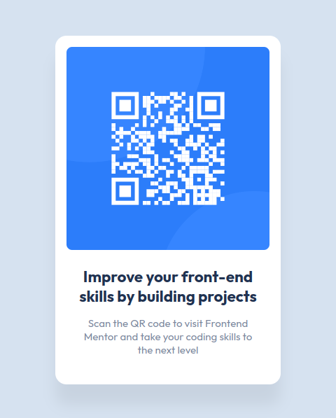

# Frontend Mentor - QR code component solution
This is a solution to the [QR code component challenge on Frontend Mentor](https://www.frontendmentor.io/challenges/qr-code-component-iux_sIO_H).  
Frontend Mentor challenges help you improve your coding skills by building realistic projects. 

## Method
This first project was made using plain HTML and CSS.

## Links
 - [Live version](https://zealous-tree-09d846110.2.azurestaticapps.net/) hosted with [Azure Static Web Apps](https://azure.microsoft.com/en-us/products/app-service/static/)
 - [Solution](https://www.frontendmentor.io/solutions/qr-code-component-2KSbVgwh3f)

## Screenshot

## Copyright
© 2023 Johnny Gérard
